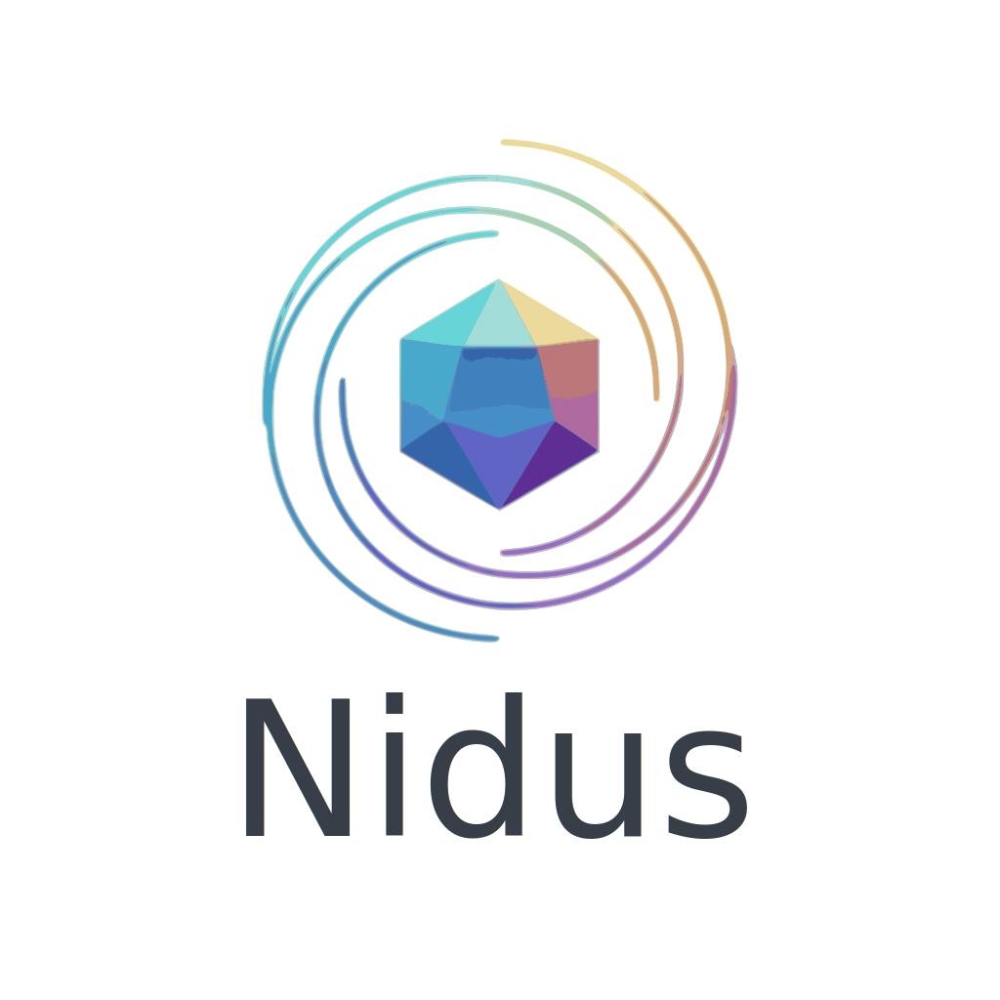

<div align="center">
  
</div>

# Nidus Multi-Agent Framework
Nidus is a highly configurable multi-agent framework built on top of [LangGraph](https://github.com/langchain-ai/langgraph). It allows you to orchestrate specialized agents using a simple YAML configuration, supporting seamless collaboration between models from OpenAI, Anthropic, and Google (Gemini).

## Features

- **YAML-Driven Orchestration**: Define your agents, their roles, goals, and specialized tools in a single configuration file.
- **Multi-Model Support**: Use `openai`, `anthropic`, or `google` (Gemini) providers for each agent individually.
- **Supervisor Pattern**: A central supervisor agent manages task routing and coordination between specialists.
- **Human-in-the-Loop**: Built-in mechanisms to interrupt execution for human feedback, comments, or guidance.
- **Comprehensive Toolset**: Includes tools for:
  - **File Operations**: Create, read, edit, list, and lint files.
  - **Execution**: Execute shell commands and interactive programs within the workspace.
  - **Knowledge Management**: Specialized tools for agents to maintain shared `.md` plans and query vector memories.
  - **Git**: Basic version control operations (clone, status, add, commit).
  - **Web Search & Scraping**: Search the web, read documentation, and scrape JavaScript-heavy sites with Playwright.
- **Persistence & Memory**: Integrated support for PostgreSQL (state check-pointing) and ChromaDB (vector memory) via Docker Compose.

## Prerequisites

- Python 3.11+
- [Poetry](https://python-poetry.org/docs/#installation)
- [Docker](https://docs.docker.com/get-docker/) & [Docker Compose](https://docs.docker.com/compose/install/)

## Setup

1. **Clone the repository**:
   ```bash
   git clone <repository-url>
   cd multiagent
   ```

2. **Install dependencies**:
   ```bash
   poetry install
   ```

3. **Configure environment**:
   Copy the example environment file and fill in your API keys:
   ```bash
   cp .env.example .env
   ```

## Usage

### Using Docker (Recommended)

To start the infrastructure (PostgreSQL and ChromaDB) and run the framework:

```bash
docker-compose up --build
```

### Running Locally

1. **Start infrastructure**:
   ```bash
   docker-compose up -d db chromadb
   ```

2. **Run the framework**:
   ```bash
   poetry run python main.py dev_team_config.yaml
   ```

## Configuration

Agents are configured in `dev_team_config.yaml`. Example:

```yaml
agents:
  - name: Architect
    role: "System Architect"
    goal: "Design the system"
    provider: "google"  # or 'openai', 'anthropic'
    model: "gemini-1.5-pro"
    tools: ["file_write", "knowledge_update"]
```

## Tools

| Tool | Description |
| --- | --- |
| `file_write` | Write content to a file. |
| `file_read` | Read content from a file. |
| `file_list` | List files in a directory. |
| `execute_command` | Execute a shell command in the workspace. |
| `edit_file` | Edit specific lines in a file. |
| `knowledge_update` | Maintain shared markdown knowledge files. |
| `run_linter` | Run code linters (e.g., flake8) on a file. |
| `query_memory` | Query the ChromaDB vector store for past context. |
| `git_status` | Get the status of the current git repository. |
| `git_add` | Add files to the git staging area. |
| `git_commit` | Commit changes to current repo. |
| `git_clone` | Clone a git repository. |
| `web_search` | Search the web for information. |
| `web_read` | Read text content from a website. |
| `scrape_with_playwright` | Scrape javascript rendered websites using Playwright fallback. |
| `doc_search` | Open and read documentation URLs. |
## License

MIT License. See `LICENSE` for details.
